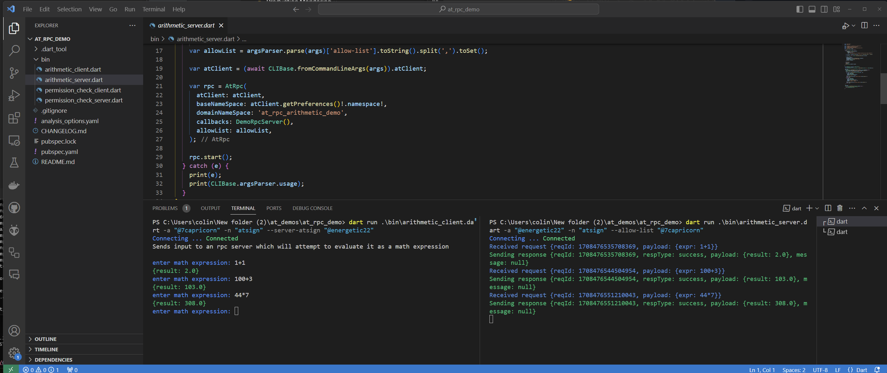

# Remote Procedure Calls (RPC)


## Do something remotely and send back the answer.

RPC has been a design pattern for decades and no surprise we have RPC in the atSDK also.  This demo code is in another directory named `at_rpc_demo`. You can get to it by using VS Code and open folder and select that folder. Next once again open two windowpanes.

In the right hand pane enter (again using your atSigns!)

```
dart pub get
```

This pulls in needed libraries, and then this starts the RPC listener.

```
dart pub get
dart run .\bin\arithmetic_server.dart -a "@energetic22" -n "atsign" --allow-list "@7capricorn"
```

Then in the left window you can run up the client

```
dart run .\bin\arithmetic_client.dart -a "@7capricorn" -n "atsign" --server-atsign "@energetic22"
```

You will get a prompt after a second or two and you can put in a math expression and hit enter. The expression will be send to the other atSign the answer calculated and then returned.&#x20;

See our session in action:

<figure><figcaption><p>RPC</p></figcaption></figure>

Couple of things to notice here are that the RPC server will only respond to RPC's from the designated atSign with the `--allow-list` argument.

The RPC can of course do anything you want it to and the atSigns can be running anywhere.

