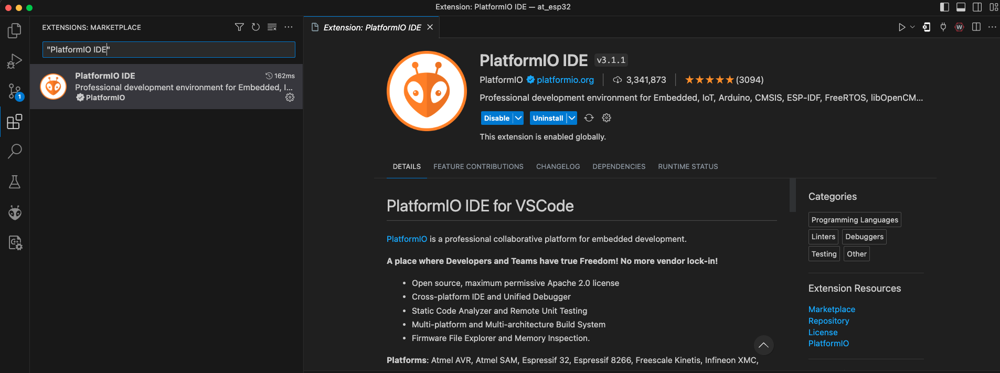

# Step 2 - Setting up your Project

Step 2 - Setting up your Project can be found in video format on our YouTube [here](https://www.youtube.com/watch?v=0sEVprF\_2Fg\&list=PLkZCny-S3rfC93\_Xqd\_HBkK\_dAjDzQ9Et\&index=2\&pp=gAQBiAQB)


Step 2 - Setting up your Project


## 1. Install the PlatformIO Extension

Open VSCode and install the PlatformIO VScode extension. You will use this extension to interact with the ESP32.

Go to **Extensions** on VSCode and search up "PlatformIO" and install it.

<figure><figcaption><p>Extensions: Marketplace > PlatformIO</p></figcaption></figure>

A little alien should popup on your sidebar. Clicking on this will open the PlatformIO Home. If you cannot find this, right click on your sidebar and click :heavy\_check\_mark: on PlatformIO.

<figure><figcaption><p>PlatformIO on your sidebar</p></figcaption></figure>

## 2. Become Familiar with "Project Tasks"

Once installed, become familiar with **Project Tasks** which can be found in your **Explorer** on VSCode. It contains an array of commands for interacting with your ESP32 easily. You will be using this a lot this tutorial.

<figure><figcaption><p>PlatformIO: Project Tasks</p></figcaption></figure>

If you cannot find **Project Tasks**, click on the three dots and check **Project Tasks.**&#x20;

<figure><figcaption><p>Explorer > Three Dots > <strong>Project Tasks</strong></p></figcaption></figure>

If you still cannot find **Project Tasks**, open the command palette (via `Ctrl/Cmd` + `Shift` + `P`) and run the "Explorer: Focus on **Project Tasks** View"

<figure><figcaption><p>Focusing on <strong>Project Tasks</strong> </p></figcaption></figure>

## 3. Install the Espressif32 Platform

Go to the **PlatformIO Home** (if you lost it just open the command palette via Ctrl/Cmd + Shift + P and search and run the `PlatformIO: Home` command).

Install the `Espressif32` platform by clicking on the `Platforms` > `Embedded` tab and searching for `Espressif32` and clicking on the `Install` button.

<figure><figcaption><p>Installing the Espressif32 Platform</p></figcaption></figure>

## 4. Creating a New Project

1. Next, go to `Projects` and press `+ Create New Project`.&#x20;
2. Name your project (Example: "My First Project").&#x20;
3. Select the `Espressif ESP32 Dev Module` board
4. Select the `Arduino` framework. Note: as mentioned in the beginning, the Arduino framework is not recommended for production use cases; instead, see the [ESP-IDF](https://docs.espressif.com/projects/esp-idf/en/latest/esp32/get-started/).
5. Select a location for your project and click "Finish."

<figure><figcaption><p>Project Wizard (after clicking <strong>+ New Project</strong>)</p></figcaption></figure>

## 5. Installing the `at_client` Library

Go back to **PlatformIO Home** and click on the `Libraries` tab. Search for `at_client` by JeremyTubongbanua[^1] and click on the `Add to your Project` button. This will install the `at_client` library in your project. Do the same for the `ArduinoJson` library by Benoit Blanchon.

<figure><figcaption><p>Adding the <code>at_client</code> Library to your Project </p></figcaption></figure>

## 6. Configuring `platform.ini`

Go to `platform.ini` and append the following line:

```ini
monitor_speed = 115200
```

Your `platform.ini` should similar:

```ini
[env:esp32dev]
platform = espressif32
board = esp32dev
framework = arduino
lib_deps = 
    jeremytubongbanua/at_client@^0.2.4
    bblanchon/ArduinoJson@^6.20.0
monitor_speed = 115200
```

[^1]: Jeremy is the engineer at Atsign who developed the at\_client SDK for PlatformIO.
