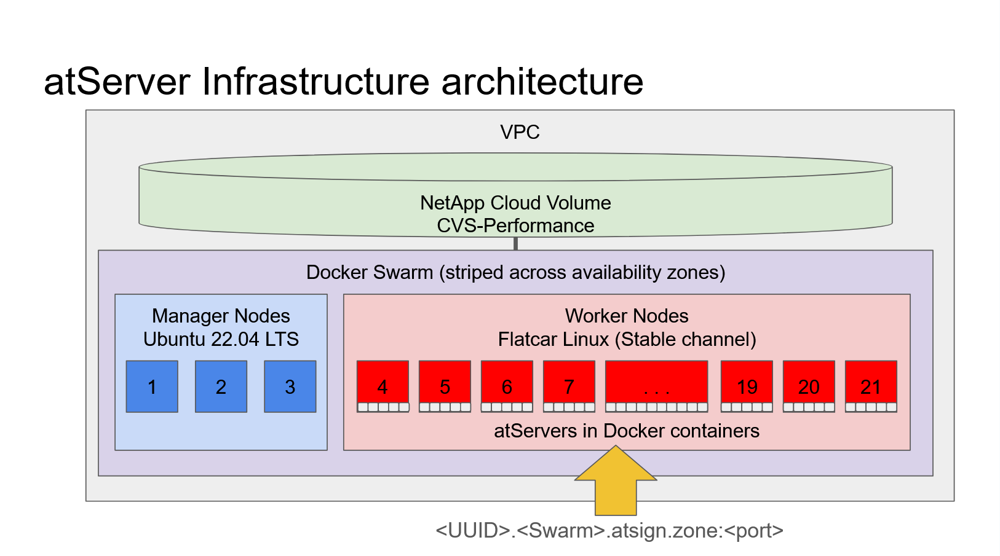

# Infrastructure

The atPlatform is designed to be distributed and allows people to run their own infrastructure for atDirectory and atServer services on their own networks but here we show how at a high level Atsign runs the Internet atPlatform Infrastructure.

The services that Atsign provide are monitored by an independent third party for uptime and can be seen here:-


UpTimeRobot Reports


## atDirectory

Atsign runs the Internet atDirectory, which has to be resilient and dependable. To provide that level of service we use Googles Cloud Platform, Kubernetes, containers and a distributed in-memory database.&#x20;

<figure><picture><source srcset=".gitbook/assets/atDirectory-dark (1).png" media="(prefers-color-scheme: dark)"></picture><figcaption>
Highly available design
</figcaption></figure>

The atDirectory runs in a GCP Virtual Private Cloud, within that VPC is an auto scalable Kubernetes cluster. This Kubernetes cluster is spread across multiple datacenters and availability zones.

The atDirectory service is found on the well-known DNS address `root.atsign.org` on port `64` this is loadbalanced across the atDirectory containers. These containers are connected again via an internal load balancer to read-only in memory databases containing the atSign to Fully Qualified Domain Name (FQDN) and port number for all atSigns.

The read only databases are kept up to date with a single read write database which in turn is updated by the registrar [website](https://my.atsign.com/), which is itself is run in another Kubernetes cluster.

This design has proved to be reliable and allows upgrades in place without downtime and automatically scales as load increases, by spinning up more containers and if required new machines getting added to the cluster itself. We have also seen resilience when datacenters or hardware has had issues the GCP platform and Kubernetes have self-healed the infrastructure.

## atServers

Each atSign has its own dedicated personal data store or atServer, each atServer is run as a Docker container within a Docker Swarm. Atsign runs a number of Docker Swarms and can move atServers from one swarm to another but relies on the manger nodes of the Docker Swarm to orchestrate and ensure each atServer is up and running if hardware fails within a swarm.

Why Docker Swarm and not Kubernetes? Kubernetes is an excellent choice for groups of conatiners that provide a service like the atDirectory or websites. But Kubernetes does not scale down well for thousands or millions of tiny independent containers like atServers.  Docker Swarm also provides highly resilient networking and is very light weight.

<figure><picture><source srcset=".gitbook/assets/atServer-dark.png" media="(prefers-color-scheme: dark)"></picture><figcaption>
resilient atServer Cluster
</figcaption></figure>

The FQDN and port number for a given atSign from the atDirectory is connected to the Docker Swarm. Each Docker swarm node will route the port number to the right container on the swarm via its internal VXLAN. The Manager Nodes are responsible to ensure each conatainer is running and available across the whole swarm.

Behind the swarm any encrypted data that needs to be stored by an atServer goes to a highly resilient NetApp Cloud Volume managed by GCP, which is presented as a network file system.&#x20;

Each of the components are spread across multiple data centers and availability zones and have proven to be highly reliable with very little downtime of individual atServers as things fail or get upgraded.
