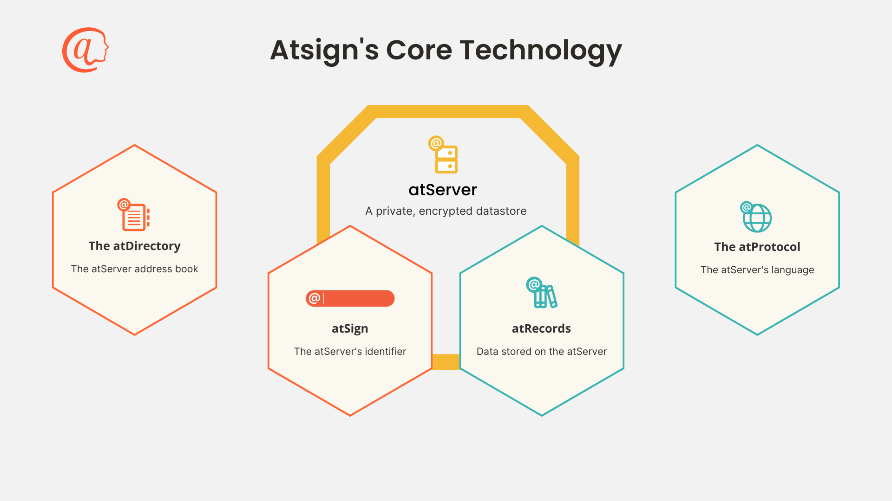

# Core Technology (atPlatform)

## Overview

<figure><figcaption></figcaption></figure>

Relationships

Every **atServer** is associated with _one_ **atSign**, and each atServer stores _many_ **atRecords.**

When provided an **atSign**, the **atDirectory** returns a _DNS address_ and _port number_ for its **atServer.**

The **atProtocol** is the _application layer protocol_ used to communicate with an **atServer.**

## atServer

An atServer is a personal data service for storing encrypted data owned by an atSign, and a rendezvous point for information exchange. An atServer is responsible for the delivery of encrypted information to other atServers, from which the owners of those atSigns can then retrieve the data.


Unless explicitly made public, atServers only store encrypted data and do not have access to the cryptographic keys, nor the ability to decrypt the stored information.


atServer Functionality

* Cryptographic authentication of client devices
* Cryptographic authentication of other atServers.
* Persistence of encrypted data on behalf of the controlling atSign.
* Caching of data shared by others with the controlling atSign.
* Notification of data change events to clients (edge devices) and other atServers to facilitate delivery of information shared with them.
* Synchronization of data with multiple clients (edge devices).
* TLS wire encryption from clients to atServers using SSL certificates.
* Mutually authenticated TLS 1.2/1.3 wire encryption between atServers using SSL certificates.

## atDirectory

In order for an atSign to communicate with another one on the internet, we need to locate the atServer that can send and receive information securely on its behalf.

The location of an atServer is found using the atDirectory service (`root.atsign.org:64`). This directory returns the DNS address and port number of the atServer for any atSign that it has a record for. The atDirectory service contains no information about the owner of the atSign.

## atProtocol


The atProtocol communicates via layer 7, the application layer of the OSI model over TCP/IP


The atProtocol is an application protocol which enables data sharing between atSigns. You can learn more about the atProtocol by reading the [specification](https://app.gitbook.com/s/OKcyQuTtJmcTiYSQrNYQ/). The atProtocol uses TCP/IP and TLS but does not specify how data itself is encrypted, that is the job of the atSDK and atClient libraries.

## atSDK

atSDKs provide developers with atPlatform specific building tools in a number of languages and for a number of operating systems and hardware. The atSDK allows developers to rapidly develop applications that use the atPlatform.
