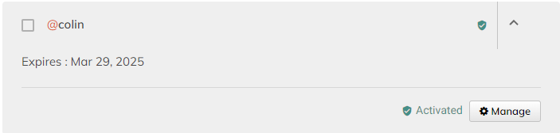

# Authentication



## Dart

### **Package Installation**

In Dart we provide the[ at\_onboarding\_cli](https://pub.dev/packages/at\_onboarding\_cli) package which handles onboarding to the atServer via files stored in the \~/.atsign/keys directory

Add the package to your project automatically using pub:

```
dart pub add at_onboarding_cli
```

### Usage

Set up the [preferences](https://pub.dev/documentation/at\_onboarding\_cli/latest/at\_onboarding\_cli/AtOnboardingPreference-class.html) to onboard to the atServer.&#x20;

```dart
 AtOnboardingPreference atOnboardingConfig = AtOnboardingPreference()
    ..hiveStoragePath = '$homeDirectory/.$nameSpace/$fromAtsign/storage'
    ..namespace = nameSpace
    ..downloadPath = '$homeDirectory/.$nameSpace/files'
    ..isLocalStoreRequired = true
    ..commitLogPath = '$homeDirectory/.$nameSpace/$fromAtsign/storage/commitLog'
    ..rootDomain = rootDomain
    ..fetchOfflineNotifications = true
    ..atKeysFilePath = atsignFile
    ..atProtocolEmitted = Version(2, 0, 0);
```

Next get the onboardingService&#x20;

```dart
  AtOnboardingService onboardingService = AtOnboardingServiceImpl(
      fromAtsign, atOnboardingConfig,
      atServiceFactory: atServiceFactory);
```

Finally wait to be onboarded, this returns true once complete.&#x20;

```dart
await onboardingService.authenticate();
```

This can be wrapped to check that the onboard was successful with the code snippet below.

```dart

bool onboarded = false;
  Duration retryDuration = Duration(seconds: 3);
  while (!onboarded) {
    try {
      stdout.write('\r\x1b[KConnecting ... ');
      await Future.delayed(Duration(
          milliseconds:
          1000)); // Pause just long enough for the retry to be visible
      onboarded = await onboardingService.authenticate();
    } catch (exception) {
      stdout.write(
          '$exception. Will retry in ${retryDuration.inSeconds} seconds');
    }
    if (!onboarded) {
      await Future.delayed(retryDuration);
    }
  }
  stdout.writeln('Connected');
```



## Flutter


If you followed the [get-started.md](../../sdk/get-started.md "mention") guide for Flutter, then you should already have onboarding setup in your app. Feel free to skip this section and move on.


### Package Installation

In Flutter, we provide the [at\_onboarding\_flutter](https://pub.dev/packages/at\_onboarding\_flutter) package which handles secure management of these secret keys.

Add the package to your project automatically using pub:

```
flutter pub add at_onboarding_flutter
```

### Usage

Simply call the [`onboard`](https://pub.dev/documentation/at\_onboarding\_flutter/latest/at\_onboarding/AtOnboarding/onboard.html) method whenever you want your app to open the onboarding widget.

```dart
AtOnboardingResult onboardingResult = await AtOnboarding.onboard(
  context: context,
  config: AtOnboardingConfig(
    atClientPreference: futurePreference,
    rootEnvironment: RootEnvironment.Production,
    appAPIKey: dotenv.env['API_KEY'],
    domain: 'root.atsign.org',
  ),
);
```

#### API Key setup

To get an API key for your app, first head to the [registrar website](https://my.atsign.com/dashboard), then click manage under one of your atSigns:

<figure><figcaption></figcaption></figure>

Then open the Advanced settings drop down and click `Generate New API Key`:

<figure><figcaption></figcaption></figure>



## C

Find the full example on our [GitHub](https://github.com/atsign-foundation/at\_demos/tree/trunk/demos/get\_started\_c/1-authentication#1---authentication).

### 1. Fetch your atServer's address from the production atDirectory

First, include `atclient_utils.h` and `#include <atclient/constants.h>` at the top of you program.

```c
#include <atclient/atclient_utils.h>
#include <atclient/constants.h>
```

Next, initialize variables that will **hold** the host and port of our atServer. We will pass pointers to these variables to the function that will populate these values for us.

```c
char *atserver_host = NULL;
int atserver_port = 0;
```

Lastly, use the `atclient_utils_find_atserver_address` function to populate our `atserver_host` and `atserver_port` variables. This function returns an `int` for error handling. A non-zero exit code indicates an error.

```c
if(atclient_utils_find_atserver_address(
  ATCLIENT_ATDIRECTORY_PRODUCTION_HOST,
  ATCLIENT_ATDIRECTORY_PRODUCTION_PORT,
  ATSIGN,
  &atserver_host,
  &atserver_port) != 0) {
  // an error occurred
}
```

Don't forget to free the `atserver_host` variable! It is mentioned in the documentation of the `atclient_utils_find_atserver_address` function that it is the responsibility of the caller to free this variable.

```c
free(atserver_host);
```

### 2. Load your atSign's atKeys

First, include `atkeys.h`.

```c
#include <atclient/atkeys.h>
```

Next, allocate memory for the `atclient_atkeys` struct. In this scenario, we are statically allocating. We need to call the `atclient_atkeys_init` function and pass a pointer to our `atclient_atkeys` struct. You will find this to be a common pattern when working with C structs. This is our method of mimicking object-oriented methodology in our C SDK.

```c
atclient_atkeys atkeys;
atclient_atkeys_init(&atkeys);
```

Finally, call the `atclient_utils_populate_atkeys_from_homedir` function which will look for your `ATSIGN`'s keys in your `$HOME/.atsign/keys/` directory.&#x20;

For example, if my atSign was `@alice`, I would have my `@alice` keys set up such that this file exists: `$HOME/.atsign/keys/@alice_key.atKeys.`

This function returns an `int` for error handling purposes. A non-zero exit code indicates that an error has occurred.

```c
if (atclient_utils_populate_atkeys_from_homedir(
  &atkeys,
  ATSIGN) != 0)
{
    // an error occurred
}
```

Don't forget to run `atclient_atkeys_free`at the end of your application. You will see it as a common pattern that for every `*_init` function that we call, we must have a corresponding `*_free` function.

```c
atclient_atkeys_free(&atkeys);
```

### 3. PKAM Authenticate

If your atSign's keys exist and your atSign's atServer is already activated, then this is known as pkam authentication.

First include `atclient.h` at the top of your application.

```c
#include <atclient/atclient.h>
```

Secondly, we will create our `atclient` object. This variable holds data necessary for doing various operations on our atServer later on (such as CRUD or Events).

```c
atclient atclient;
atclient_init(&atclient);
```

Thirdly, call the `atclient_pkam_authenticate` function.&#x20;

This function connects to the atServer (if necessary) and uses your atSign's atKeys file to generate a special pkam command by signing a challenge sent from the atServer. Once pkam authentication is successful, your connection will be authenticated and your client will be free to make various operations on the atServer.

This function will return an `int` for error handling, in which a non-zero exit code indicates an error.&#x20;

````c
```
if (atclient_pkam_authenticate(
  &atclient,
  atserver_host,
  atserver_port,
  &atkeys,
  ATSIGN) != 0)
{
  // error occurred
}
```
````

Lastly, do not forget to call `atclient_free` at the end of your application.

```c
atclient_free(&atclient);
```

### Example Application

Here is an example application that authenticates my atSign `@jeremy_0`.

This code is also available on our [GitHub](https://github.com/atsign-foundation/at\_demos/tree/trunk/demos/get\_started\_c/1-authentication#1---authentication).

```c
#include <atclient/atclient.h>
#include <atclient/atclient_utils.h>
#include <atclient/constants.h>
#include <atlogger/atlogger.h>
#include <stdlib.h>

#define ATSIGN "@jeremy_0"

int main()
{
    int exit_code = -1;

    /*
     * this function will print DEBUG logs and below
     */
    atlogger_set_logging_level(ATLOGGER_LOGGING_LEVEL_DEBUG);

    /*
     * these variables will hold the output of the atclient_utils_find_atserver_address function
     */
    char *atserver_host = NULL;
    int atserver_port = 0;

    /*
     * the `atkeys` variable will hold the encryption keys that the atClient will use to do various things like authentication and end-to-end encryption.
     * these keys are typically located in `~/.atsign/keys/` and would have been generated by you for each atSign using at_activate.
     * It is important to call the `_init` function before using the struct.
     */
    atclient_atkeys atkeys;
    atclient_atkeys_init(&atkeys);

    /*
     * the `atclient` variable will hold the state of the atClient and is used to interact with the atServer.
     * you will need to pass this context to most atclient functions
     * It is important to call the `_init` function before using the struct.
     */
    atclient atclient;
    atclient_init(&atclient);

    /*
     * this function will find the atServer's address from the atDirectory
     * and populate the `atserver_host` and `atserver_port` variables
     * with the atServer's address and port.
     * Don't forget to free the `atserver_host` variable after use, when using this function.
     */
    if ((exit_code = atclient_utils_find_atserver_address(ATCLIENT_ATDIRECTORY_PRODUCTION_HOST, ATCLIENT_ATDIRECTORY_PRODUCTION_PORT, ATSIGN, &atserver_host, &atserver_port)) != 0)
    {
        goto exit;
    }

    /*
     * my keys are assumed to be set up in ~/.atsign/keys/@soccer99_key.atKeys
     * this function will read the keys from the file and populate the `atkeys` variable
     */
    if ((exit_code = atclient_utils_populate_atkeys_from_homedir(&atkeys, ATSIGN)) != 0)
    {
        goto exit;
    }

    /*
     * this function will connect to the atServer, if it is not already connected,
     * then authenticate to the atServer and establish an authenticated connection
     * using the populated `atkeys` variable.
     */
    if ((exit_code = atclient_pkam_authenticate(&atclient, atserver_host, atserver_port, &atkeys, ATSIGN)) != 0)
    {
        goto exit;
    }

    atlogger_log("my_first_c_app", ATLOGGER_LOGGING_LEVEL_INFO, "Authenticated to atServer successfully!\n");

    exit_code = 0;
exit:
{
    free(atserver_host);
    atclient_atkeys_free(&atkeys);
    atclient_free(&atclient);
    return exit_code;
}
}
```




