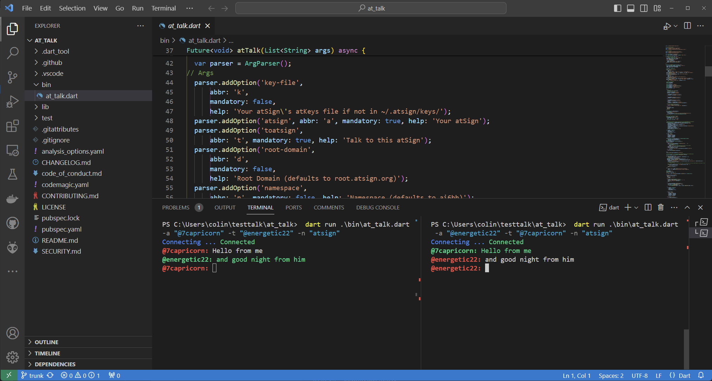

# atTalk - Encrypted chat client

For the final example we have at\_talk, which is a fully end-to-end encrypted chat application in less than 300 lines of code. There is nothing pretty, its just a command line app, that takes the Unix/Linux command `talk` to a global level.

The command `talk` allows people on a Unix/Linux machine to IM each other, at\_talk allows anyone with an atSign to talk with each other.

This code is in a separate repo so once again in VS Code click the "Clone Git Repository" button. The enter:

```
https://github.com/atsign-foundation/at_talk.git
```

<figure><figcaption></figcaption></figure>

Like before, you will get asked if you want to run `pub get` and say yes or if you prefer you can open a terminal window and type:

```
 dart pub get
```

This as we know pulls in the needed libraries and the code will loose all the red underlines as those libraries are loaded.

At this point we can open two terminal panels as we have done before and run the at\_talk code.  You can run at\_talk without any arguments and it will return some help:

```
dart run .\bin\at_talk.dart
-k, --key-file                Your atSign's atKeys file if not in ~/.atsign/keys/
-a, --atsign (mandatory)      Your atSign
-t, --toatsign (mandatory)    Talk to this atSign
-d, --root-domain             Root Domain (defaults to root.atsign.org)
-n, --namespace               Namespace (defaults to ai6bh)
-v, --verbose                 More logging
    --never-sync              Completely disable sync
Invalid argument(s): Option atsign is mandatory.
```

&#x20;From here you can split windows like before and run two at\_talk applications and send messages to each other.

In the left window for example (subsitute your own atSigns!

```
 dart run .\bin\at_talk.dart -a "@7capricorn" -t "@energetic22" -n "atsign"
```

In the right window, the same but in reverse.

```
 dart run .\bin\at_talk.dart -a "@energetic22" -t "@7capricorn" -n "atsign"
```

In this session you can see the typed messages in white and th received messages in green with the prompts in red.&#x20;

<figure><figcaption><p>talking atSigns</p></figcaption></figure>

Unlike Linux talk, however these two atSigns can be anywhere on the Internet and communicating with Privacy, get a friend to run through the demo and use at\_talk !

There are a couple of features, that are worth mentioning you can use the `/` and then an atSign to change who you are sending messages to and yes you can message to yourself.

The other feature that has proved very useful is being able to "pipe" commands to at\_talk. To do this you can compile the code to a binary using:

```
dart compile exe -o attalk bin/at_talk.dart
```

Now you can "pipe" the output of a command into the chat with the other atSign.

```
cat .\bin\at_talk.dart| attalk -a "@energetic22" -t "@7capricorn" -n "atsign"
```

This prints the code of at\_talk.dart into the receiving atsigns chat window. To our knowledge the is the only chat application that you can pipe things too!

If you go this far first thank you and second, please enjoy your continuing journey and raise issues and PR's to any of the repos!
