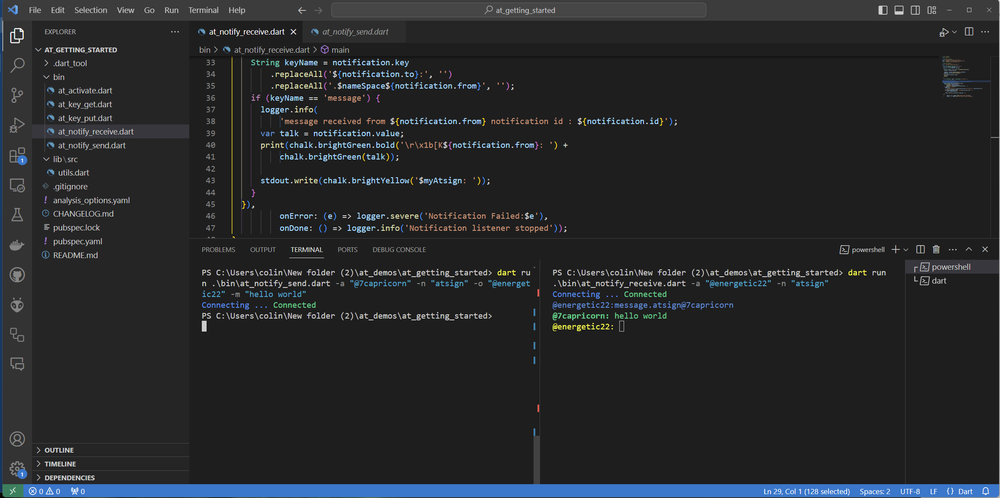

# Send and Receive data synchronously.

## Sending and receiving data in near real-time

Sending data as we saw is pretty easy but the receiver would have to continually poll unless we had a mechanism to notify the receiving atSign that they had data to deal with. Fortunately we have just that with atNotifications.

A notification can be sent to an atSign and if that atSign is listening for it, it will create an event that can be handled as soon as the notification is received.

To receive we can use code like this:

```dart
  atClient.notificationService
      .subscribe(regex: 'message.$nameSpace@', shouldDecrypt: true)
      .listen(((notification)
```

And to send code like this:

```dart
  await atClient.notificationService.notify(
      NotificationParams.forUpdate(sharedRecordID, value: message));
```

There are two examples in the repo `at_notify_receive.dart` and `at_notify_send.dart` both contain the basics to send an receive synchronously.&#x20;

To test for yourself you will need two terminal windows to do that you can press the split button on the VS Code IDE.

<figure><figcaption></figcaption></figure>

You can then run the following commands agian note to replace the atSigns with your own.

In the right window run this first to receive:

```dart
dart run .\bin\at_notify_receive.dart -a "@energetic22" -n "atsign"
```

In the left window you can now send a message using:

```dart
dart run .\bin\at_notify_send.dart -a "@7capricorn" -n "atsign" -o "@energetic22" -m "hello world"
```

The net result should look like this, and your message should appear in the right-hand side.&#x20;

<figure><figcaption><p>Message received.</p></figcaption></figure>

You can try sending different messages and make sure they arrive, you can also put Dart on another machine and talk from machine to machine without setting up any other infrastructure.&#x20;

Neither the sender nor the receiver need any TCP ports open so this can be used to send end to end encrypted messages in near real-time without VPNs/Firewalls being required, just access to the Internet.

If you are thinking this is the basis of a simple end-to-end encrypted chat application, that's coming soon with at\_talk.

