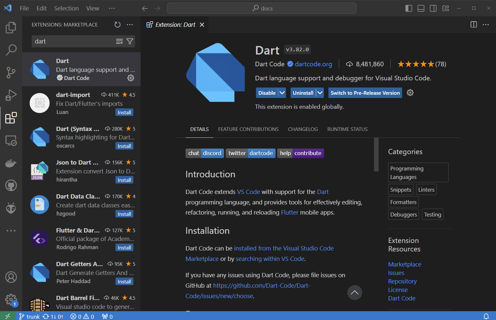

# Using the atSDK with Dart

## What and why Dart ?

&#x20;Dart is an opensource project from Google offering a fast and multi-platform programming language. The atPlatform team choose Dart as a high level language to build proof of concept code but Drat proved to be a fast and reliable language to build on and as we needed features like being able to compile to executables, the Dart team delivered.&#x20;

At this point we have ported the atSDK to other languages, like Java and Python the Dart atSDK is a great place to start.&#x20;

## Get Dart

Dart is available at [dart.dev](https://dart.dev/get-dart) for Windows, Linux, macOS, download and follow the instructions to install Dart. You can program in the IDE of your choice, but we can recommend [VS Code](https://code.visualstudio.com/) as it has excellent support for Dart, download install VS Code then install the Dart extension.

<figure><figcaption>
to get to the Extensions screen press "Control Shift X" then add Dart 
</figcaption></figure>
